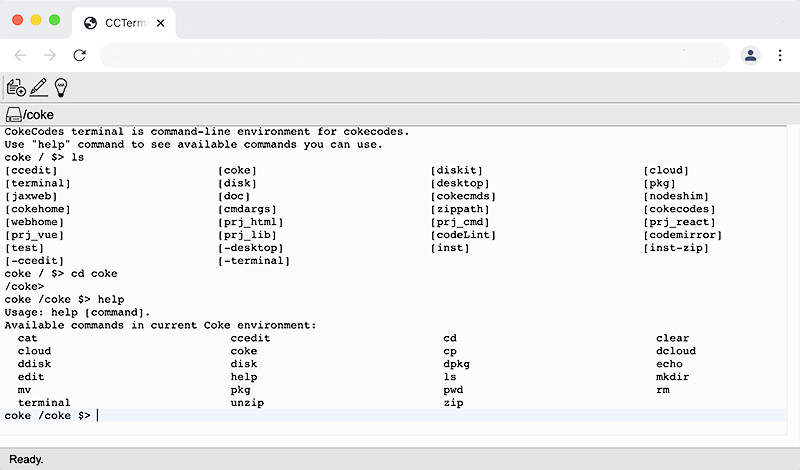
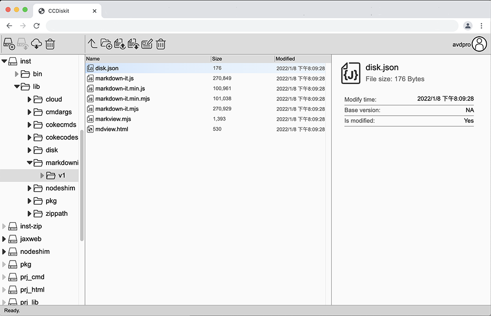

# CokeCodes conecpt preview

## What is Cokecodes?
Cokecodes is designed to be a **in-browser** Web/App development environment. It brings the essence of morden OS (like MacOS, Windows, Unix) to the browser. Developers can do all works within browser. Even it's in such early stage, 90% of my coding work is done in browser with CokeCodes tools now.  
  
## Tools and Applictions
Cokecodes currently has a **desktop** and 3 major PWA web app tools: **Terminal**, **Diskit** and **CCEditor**:  
  
### CCEditor  
  

**CCEditor** is a full-functional **code text edtor**. It's based on the great work of **CodeMirror**. It got almost all the cool feaures that morden code editors have: **Syntax highlights**, **Code folding**, **Autocompletion**, **Linter integration**, **Search and replace**, **Bracket and tag matching**, **Marks and todos** and more.  

### Terminal  
  

**Terminal** is a UNIX terminal like CLI enironment which can run commands (ls, cwd, cd, cp, rm...), apps and scripts.  
  
### Diskit  
  

**Diskit** is the file manager of CokeCokes system. It works like just **File Explorer** in Windows or **Finder** in MacOS.

  
## Why work in browser?
With new features coming out, morden browsers can do much more than just browsing. PWA web apps will take more roles from native apps. Why not our coding environment?  
- **No system contamination**: Setup a new project work environment won't install anything or make any changes out side the browser. Your computer/ device always stay clean. 

- **Domain sandboxed**: You can isolate different projects to avoid annoying package/tool version conflict which do happens a lot these days. Remove a sandbox cleans everthing, no trush left behind. It's like you have a dedicate computer for each of your project in the same time!

- **Same experience**: CokeCodes' tool and applications works just as good as similar tools run in native. They launch in a blink, and run smoothly the in browsers. All tools are open sourced and support addons to expand their features.   

- **Any device, any time**: Browsers are best cross-platform-environment out there. Cokecodes can run on all morden major browsers on desktop or mobile devices. With it's inbuilt cloud feature, you can easily pick up your work any where, any time. 

## It's all about productivity
- **Work offline**: As PWA apps, all Cokecodes tools/apps can work offline so you won't concern about the network connection while working. 

- **Cloud repository**: Projects (disks) in Cokecodes file system can be synced with CokeCodes cloud repository. You can access your works anytime, anywhere, on any devices. More public clouds support is on the way.

- **Packages**: Cokecodes has a **npm** like package system. Libs, tools and apps are deliverd as packages. With minor modifications, most node packages can be port into browser. You can install, update packages to setup or enhance your coding power. You can make your own packages and share with others too. 

## Open to power
CokeCodes' system, applictions and command tools are all write in pure Javascript and all **open source**. You can easily make your own tools, addons even applications to aid your work and share with others. You can host your own cokecodes server, too.

## Incomming more
This version of CokeCodes is just a concept preview. So I am not recommanding to use CokeCodes as real development tool for now. More features are incomming, check the **Roadmap** below and stay tunned!

## Dev road map:
- **Overall**:
	- Better mobile devices (phones and tablets) support
	- More documents  
	- Disk member access
	- Python support
	
- **File system/ Diskit**:
	- **watch** changes callback
	- File **sync access** solution
	- Sync disk with other repository like GitHub, DropBox
	- Sync disk with locale folder  
	
- **CCEdit**:
	- Settings, themes, night mode...
	- Support more coding language (PY/ C,C++ /Java...)
	- Support collaborate coding
	- **Addon-Cody**: powerful WYSWYG UI-Builder tool behind the major CokeCodes apps.
	
- **Tools, utility packages**:
	- Port **Babel**, **webpack** and more utilities to have better support React/ VUE projects.
	- Server mockup/develop mechanism with database simulator
	- Self-host cokecodes server setup.
	- Port **Emscripten** to enable C++ and other WASM developments
	- Mobile app wrap and publish tool
	- **CCCompare**: "Beyond Compare" like comapre application, "Beyond Compare" is one of my favorite apps for all times.
## Like the idea?
CokeCodes is my hobby project. Although very simple and rough, it is indeed working and looks really promising. My earlier web/app development tool chain is node+WebStorm, now my work is done 90% in browser. Hope with new incomming features, it hits 100%!  
If you like to **work in browser**, have ideas to improve, welcom to contact at: pxavdpro@gmail.com.
